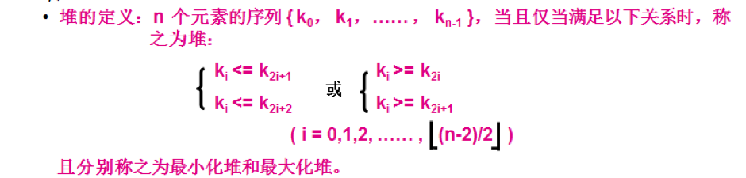
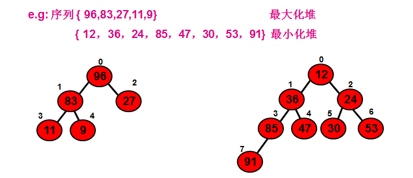
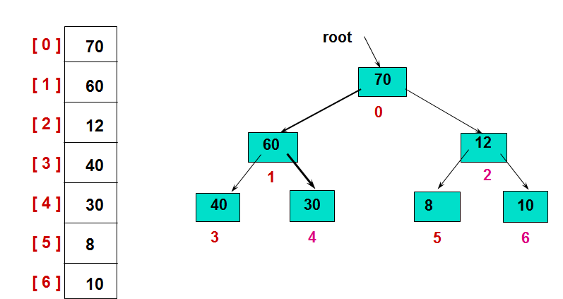
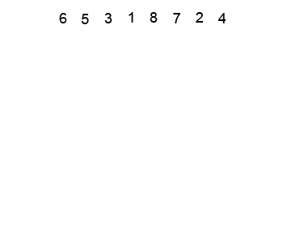
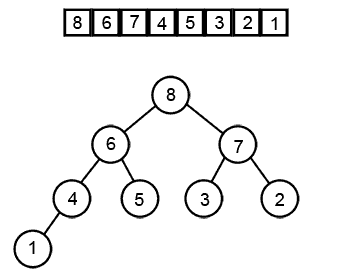

# 堆排序

定义
-----

* 大根堆：父节点的值大于左右子节点的值
* 小根堆：父节点的值小于左右子节点的值

堆的存储(大根堆)
----

左图为其存储结构，右图为其逻辑结构。

堆排序的实现
-----
#### 实现堆排序需要解决两个问题：
1. 创建堆：如何由一个无序序列(数组)建成一个堆？
2. 排序堆：如何在输出堆顶元素之后，调整(排序)剩余元素成为一个新的堆？

#### 创建堆（大根堆）
用数组元素构建二叉树，先放根，再放左右孩子，如果孩子比父亲大，就交换父子节点。

#### 排序堆（大根堆）
交换堆顶的元素和最后一个元素（会破坏孩子节点的堆），此时最后一个位置作为有序区（有序区显示为黑色），然后进行其他无序区的堆调整，重新得到大顶堆后，交换堆顶和倒数第二个元素的位置。
数组后面是有序的，前面是无序的，慢慢从后往前把最大的值从堆里取出来放到数组后面。

创建堆以及排序
----

